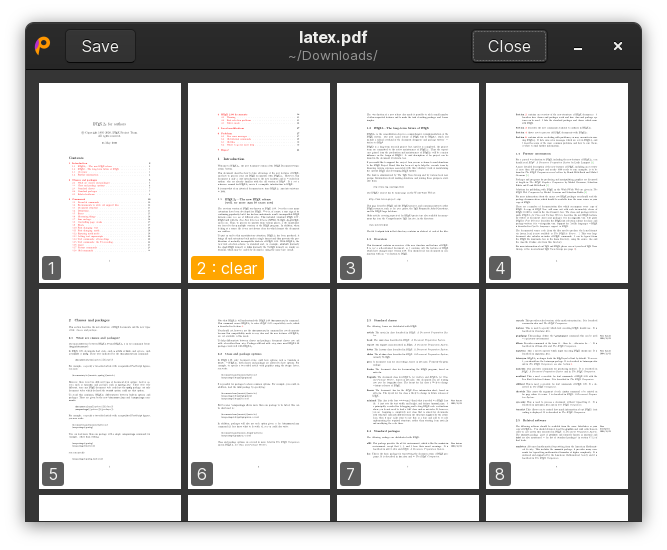

PDFrankenstein is GUI tools that intends to fill the gap on Linux where
a good capable PDF annotator like Adobe Acrobat does not exist.

## What can you do with it?

- Put your signature on documents.
- Fill forms.
- Add clickable links.
- Draw on documents and highlight areas.
- Multiple page PDFs are supported.
- Anything you can do in Inkscape.



## Requirements

- Recent version of [Inkscape](https://inkscape.org/)
- [poppler-utils](https://poppler.freedesktop.org/)
- [qpdf](https://github.com/qpdf/qpdf)

## Install

Packages are available for:

- [Arch Linux](https://aur.archlinux.org/packages/pdfrankenstein): `yay -S pdfrankenstein`

## Download

Download the latest version from the [releases
page](https://github.com/oxplot/pdfrankenstein/releases). Alternatively,
you can checkout and build the code:

```sh
git clone https://github.com/oxplot/pdfrankenstein.git
cd pdfrankenstein
go build
./pdfrankenstein
```

## How does it work?

When you select a page to annotate, it's converted to SVG, made into a
locked background of another SVG which is opened in Inkscape for you to
draw on. After annotating all the pages needed, saving the file will go
through all the annotated pages, and for each removes the added
background, exports the page to PDF and finally overlays each annotation
on the corresponding page of the orignal PDF and outputs the final file.

Inkscape is used much like `vim` or `emacs` are used as your editor in
the shell when you run `crontab -e`. Instead of `crontab` implementing
its own editor, it creates a temporary file, runs `vim` and checks if
the file is updated after `vim` is closed.
